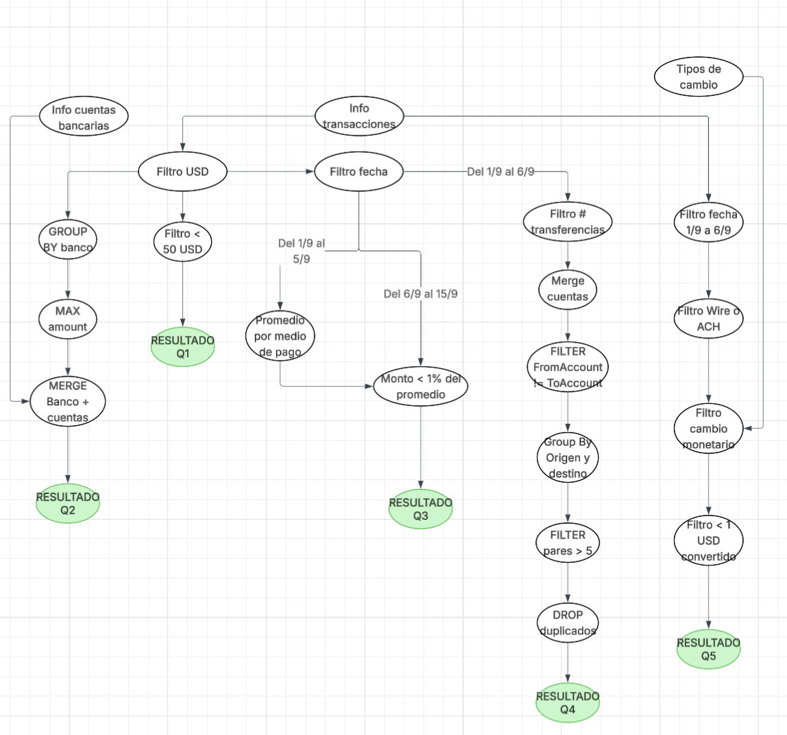

# Project overview

El proyecto se trata de una implementacion para la materia de sistemas distribuidos 1 de la carrera de ingenieria informatica.

El enunciado es el siguiente:

- Se solicita un sistema distribuido que analice el extracto de transacciones realizadas entre
cuentas bancarias en busca de anomalías.
-  Se debe obtener:
    1. Cuenta de origen, cuenta de destino y monto para transacciones USD menores a 50.
    2. Nombre de banco, cuenta de origen y monto de la max. transacción USD de cada banco.
    3. Cuenta de origen y monto de transacciones USD en el período [2022-09-06, 2022-09-15]
    con monto menor a 1 centésimo del promedio encontrado para el mismo formato de
    pago en el período [2022-09-01, 2022-09-05]
    4. Cuentas que cumplan con el patrón scatter-gather con una sola cuenta de separación,
    para cuentas que hayan realizado transferencias en USD hacia 5 cuentas distintas dentro
    del período [2022-09-01, 2022-09-05]
    5. Cantidad de transacciones del período [2022-09-01, 2022-09-05] con formato de pago
    "Wire" o "ACH" cuyo monto convertido a USD sea menor a 1

El lenguaje utilizado es Python. Las pruebas se hacen desde un docker compose y se usa un Makefile para cambiar entre las pruebas de forma dinamica.

# Convenciones

El codigo de cada entidad del sistema se encuentra sobre el directorio /src. Ahi se pueden ver el codigo de cada entidad que sera desplegada en el sistema (Filters, Aggregators, Join, etc)

A continuacion te dejo un diagrama DAG con el flujo de datos del sistema

# Restricciones

No usar librerias externas que solucionen problemas grandes, la idea es hacer algo mas o menos integro. Si se pueden usar librerias para middlewares, hash o comunicacion de red.

# Que falta actualmente

Quiero completar la query 3: Cuenta de origen y monto de transacciones USD en el período [2022-09-06, 2022-09-15] con monto menor a 1 centésimo del promedio encontrado para el mismo formato de pago en el período [2022-09-01, 2022-09-05]